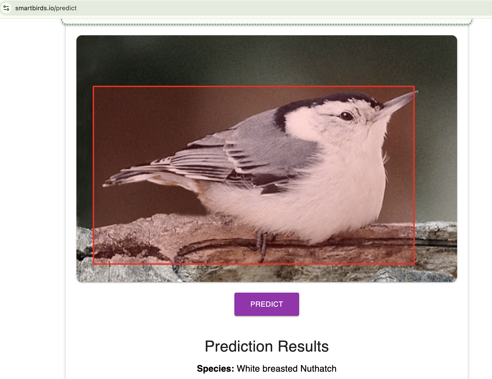
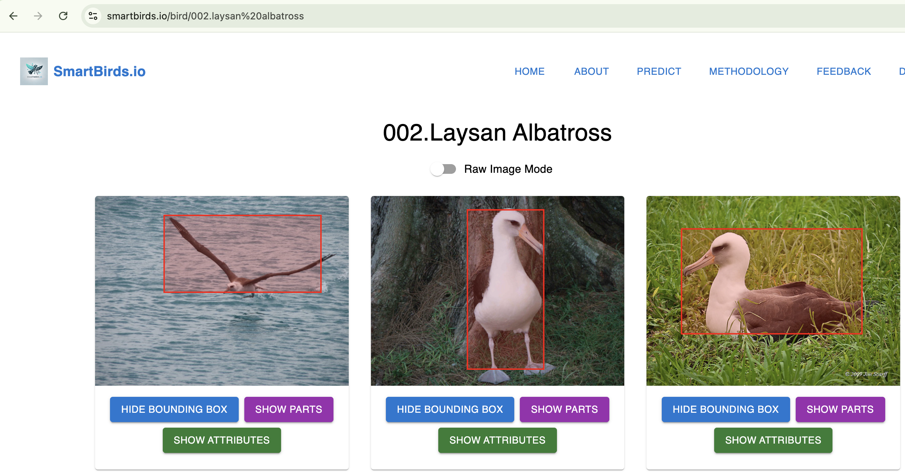

# SmartBirds.io

## A Free Bird Detection and Classification Application

---

## Overview

Welcome to **SmartBirds.io**! This application offers a free and efficient solution for bird detection and classification, leveraging a vision transformer (ViT) for accurate identification of various bird species. 

---

## Features

- **Accurate Classification:** Utilizes **Vision Transformers (ViT)** fine-tuned on the Caltech Bird dataset for high-precision bird species identification.
- **Real-time Detection:** Implements **YOLOv5** for real-time bird detection and cropping, ensuring focused analysis.
- **Extensive Dataset Exploration:** Explore a comprehensive dataset of **11,788 images** with over **300 attributes** and pre-labeled bounding boxes.
- **Interactive Visualization:** Dynamically plot specific parts and visualize bounding boxes for enhanced data analysis.
- **User-Friendly Interface:** Easily navigate through attributes with color-coded certainty levels for each image.
- **Free Model Access:** Deployed via **Cloud Run** and **Docker**, allowing easy access and scalability.

---

## Methods: Vision Transformers (ViT)

For a model that balances size and accuracy, we employ **Vision Transformers (ViT)** from HuggingFace, fine-tuned on the Caltech Bird dataset. ViT offers comparable performance to modern CNNs with fewer parameters, making it ideal for deployment.

At test time, we utilize **YOLOv5** to detect and crop the bird from the background, ensuring that our ViT model focuses on the bird, thereby enhancing classification accuracy.

---

## Access the Model and Application

- **Website:** [SmartBirds.io](https://SmartBirds.io)
- **Alternative Access:** If the custom domain doesn't work, access it directly via our cloud app [Here](https://bird-frontend-tylpg5al2a-uc.a.run.app)

### Free Model Access

These models are deployed via **Cloud Run** and **Docker**, ensuring scalability and reliability. You can access and integrate these models into your projects effortlessly.

---

## Live Demonstration

### Landing Page

Explore the interactive dataset of **11,788 images**, enriched with attributes and pre-labeled bounding boxes. Utilize the "Parts" button to dynamically plot specific parts or visualize bounding boxes, or explore over 300 attributes for each image, with color coded certainity. 

### Prediction Page

Identification is required before classification. We employ YOLOv5 to detect and crop the bird from the background, ensuring accurate classification by our fine-tuned ViT model.

### Bounding Boxes Visualization

Visualize bounding boxes on pre-labeled and predicted images. 

---

## Dataset

SmartBirds.io utilizes the [Caltech-UCSD Birds-200-2011 dataset](https://www.vision.caltech.edu/datasets/cub_200_2011/), comprising **11,788 images** across **200 bird species**. This well labeled and documented dataset is used for training and evaluating the models, ensuring high accuracy and reliability. 

---

## Sources

1. **Cal-Tech Vision Lab:** [Caltech-UCSD Birds-200-2011 Dataset](https://www.vision.caltech.edu/datasets/cub_200_2011/)
2. **Vision Transformers:** [An Image is Worth 16x16 Words: Transformers for Image Recognition at Scale](https://arxiv.org/abs/2010.11929)

---

## Contact

If you have any questions or feedback, feel free to reach to contact me.

---
